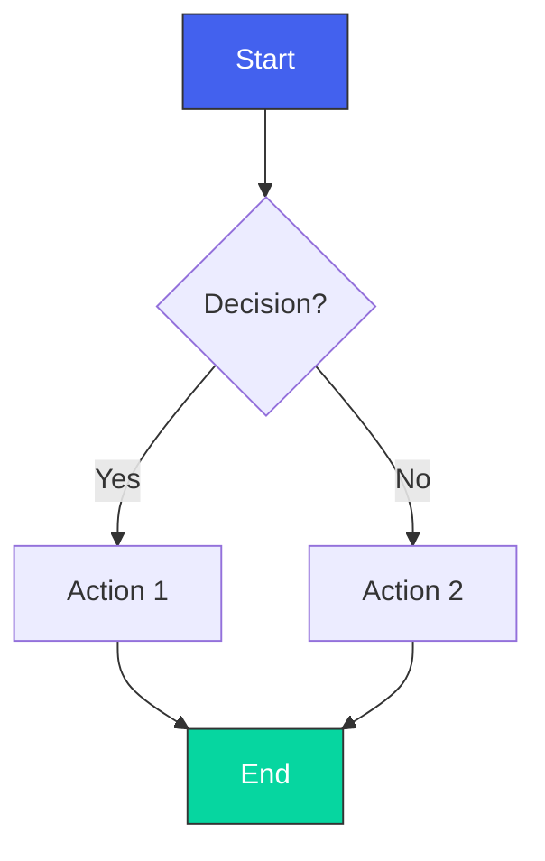
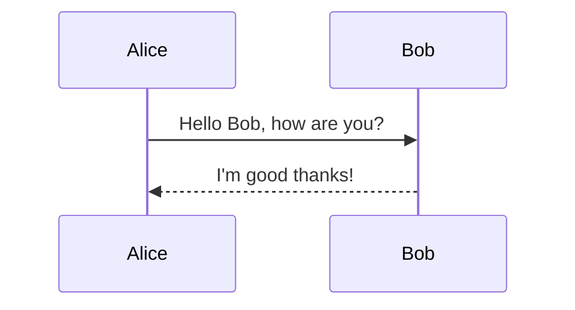
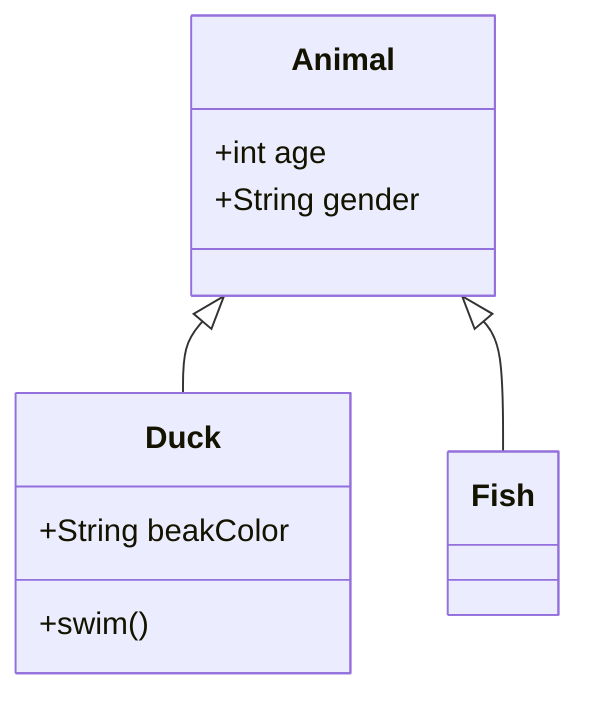
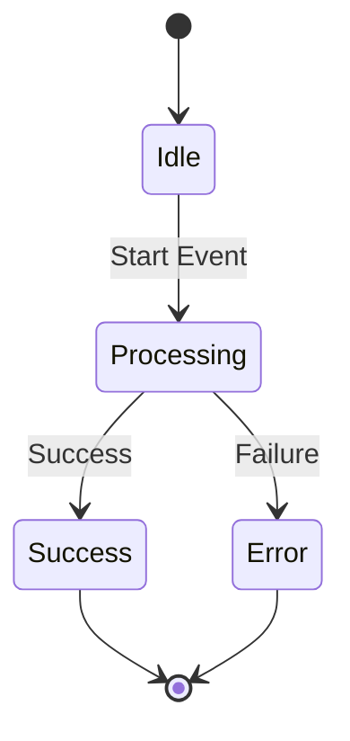
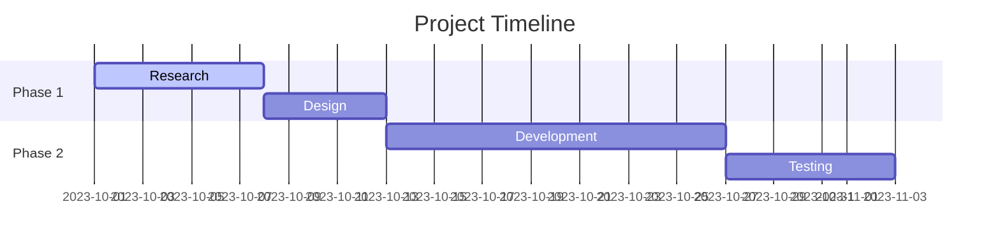
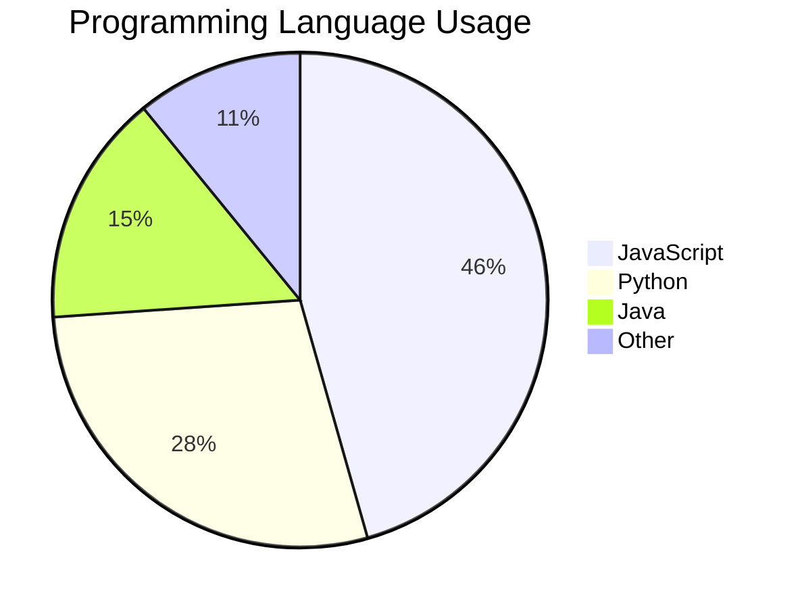
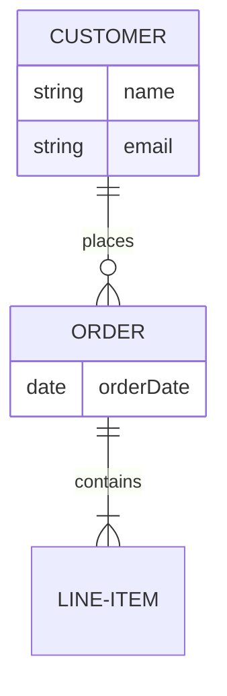
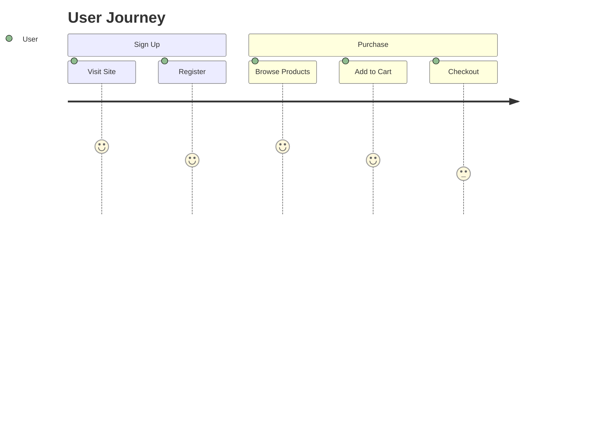

# Mermaid Chart Maker 

A full-featured web editor for creating, editing, and sharing [Mermaid.js](https://mermaid.js.org/) diagrams with live preview and export capabilities.

[](LICENSE)
[](https://bjmdevelopers.github.io/Mermaid)

## 🌟 Features

### Diagram Support
- **Flowcharts** (`graph TD`/`graph LR`)
- **Sequence diagrams** (`sequenceDiagram`)
- **Class diagrams** (`classDiagram`)
- **State diagrams** (`stateDiagram-v2`)
- **Gantt charts** (`gantt`)
- **Pie charts** (`pie`)
- **Entity Relationship diagrams** (`erDiagram`)
- **User Journey diagrams** (`journey`)

### Editor Features
- Real-time preview rendering
- Syntax highlighting for Mermaid code
- Code formatting/beautification
- Responsive design (works on all devices)
- Line numbering
- Error highlighting

### Export Options
- Download as SVG (vector)
- Download as PNG (raster)
- Generate shareable URL

### Advanced Functionality
- Custom styling support
- Diagram zoom controls
- Auto-save functionality

## 🚀 Getting Started

### Prerequisites
- Modern web browser (Chrome, Firefox, Edge, Safari)
- Internet connection (for CDN resources)

### Using the Web App
1. Visit the [Website](https://bjmdevelopers.github.io/Mermaid)
2. Write or paste your Mermaid code in the editor
3. View the live-rendered diagram
4. Use the toolbar to export or share

### Local Development
3. **Clone the repository**:
   ```bash
   git clone https://github.com/bjmdevelopers/Mermaid.git
   ```
2. **Navigate to project folder**:
   ```bash
   cd Mermaid
   ```
3. **Open in browser**:
   ```bash
   open index.html
   ```
## 📚 Diagram Examples 

### Flowchart


### Sequence Diagram


### Class Diagram


### State Diagram


### Gantt Chart


### Pie Chart


### Entity Relationship Diagram


### User Journey Diagram

## 🛠️ Technical Details 

### Core Components
- **Editor**: Vanilla JavaScript text editor with syntax highlighting
- **Renderer**: Mermaid.js integration with live preview
- **Export**: SVG/PNG generation via native browser APIs
- **State**: Lightweight state management using localStorage

### Key Features
- 100% client-side (no backend required)
- Zero build step (runs directly in browser)
- <5kb JavaScript (excluding dependencies)
- Responsive CSS grid layout

### Dependencies
| Library | Purpose | Version |
|---------|---------|---------|
| [Mermaid.js](https://mermaid.js.org/) | Diagram rendering | 10.x |
| [Font Awesome](https://fontawesome.com/) | UI Icons | 6.x |
| html2canvas | PNG export | 1.4.x |

## 📜 License
MIT Licensed - See [LICENSE](LICENSE)

## 🙏 Credits
- Mermaid.js team for the powerful visualization engine
- Font Awesome for the clean icon set
